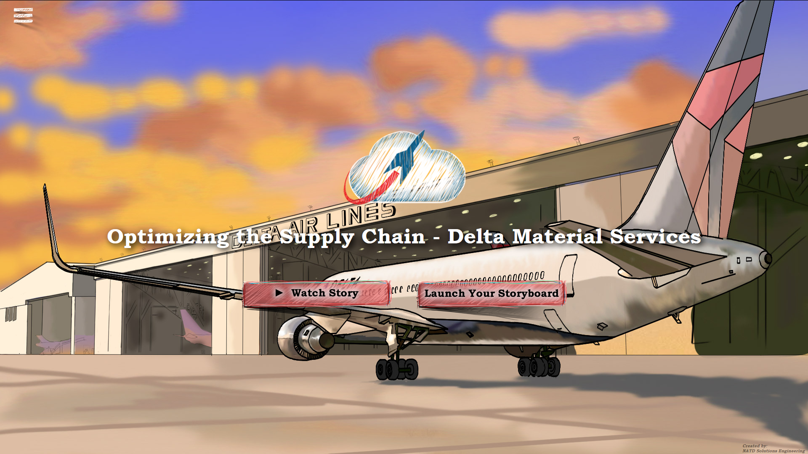
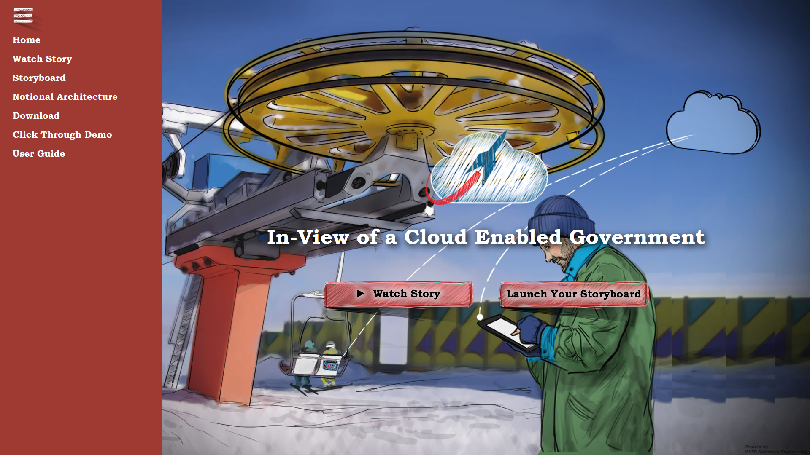
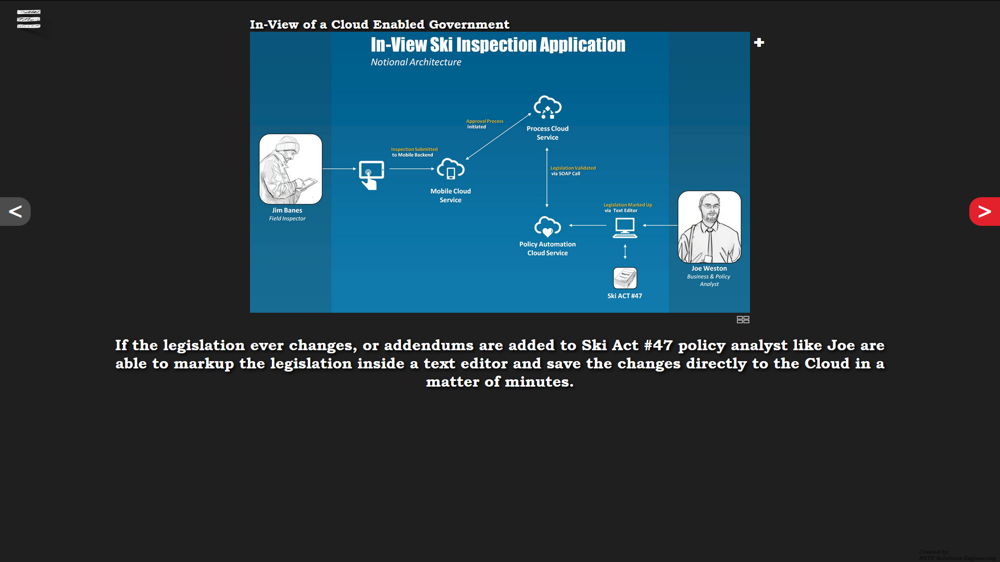

# Cloud Accelerate Landing pad template.
In 2016 I had helped create Oracle Cloud Accelerate program. The program captured and visualized business use cases and presented back to leadership with the ask of creating a real technical POC. The solution did an amazing job of showcasing the power of the Cloud to the LOB to generate new demand. This codebase ran in the DMZ for customers to view and share ideas.

Examples:

# This codebase will showcase several options or examples of ficticous use case stories created with customers.
